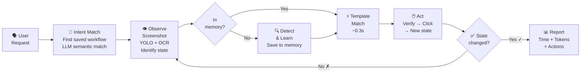

<div align="center">
  

  <h1>🦞 GUIClaw</h1>

  <p>
    <strong>See your screen. Learn every button. Click precisely.</strong>
    <br />
    Vision-based desktop automation skills for <a href="https://github.com/openclaw/openclaw">OpenClaw</a> agents on macOS.
  </p>

  <p>
    <a href="#-quick-start"></a>
    <a href="#-quick-start"></a>
    <a href="https://discord.gg/BQbUmVuD"></a>
  </p>

  <p>
    
    
    
    
  </p>
</div>

---

<p align="center">
  <b>🇺🇸 English</b> ·
  <a href="docs/README_CN.md">🇨🇳 中文</a>
</p>

---

## 🔥 News

- **[03/19/2026]** v0.4.0 — **Workflow memory + async polling**: Saved workflows auto-matched by LLM intent; `wait_for` command (template-match polling, no blind clicks); mandatory timing & token delta reporting; multi-window fix (selects largest window).
- **[03/19/2026]** v0.3.0 — **Click-graph state architecture**: UI modeled as a graph of states; each click creates a new state entry; state identification via OCR text matching. Removed pages/regions/overlays complexity.
- **[03/17/2026]** v0.2.0 — Workflow-based revise, event-driven polling, mandatory operation protocol (observe→verify→act→confirm), per-app visual memory with auto-cleanup.
- **[03/16/2026]** v0.1.0 — GPA-GUI-Detector integration, Apple Vision OCR, template matching, browser automation, per-site memory.
- **[03/10/2026]** v0.0.1 — Initial release: WeChat/Discord/Telegram automation, app profiles, fuzzy app matching.

## 💬 What It Looks Like

> **You**: "Send a message to John in WeChat saying see you tomorrow"

```
OBSERVE  → Screenshot, identify current state
           ├── Current app: Finder (not WeChat)
           └── Action: need to switch to WeChat

STATE    → Check WeChat memory
           ├── Learned before? Yes (24 components)
           ├── OCR visible text: ["Chat", "Cowork", "Code", "Search", ...]
           ├── State identified: "initial" (89% match)
           └── Components for this state: 18 → use these for matching

NAVIGATE → Find contact "John"
           ├── Template match search_bar → found (conf=0.96) → click
           ├── Paste "John" into search field (clipboard → Cmd+V)
           ├── OCR search results → found → click
           └── New state: "click:John" (chat opened)

VERIFY   → Confirm correct chat opened
           ├── OCR chat header → "John" ✅
           └── Wrong contact? → ABORT

ACT      → Send message
           ├── Click input field (template match)
           ├── Paste "see you tomorrow" (clipboard → Cmd+V)
           └── Press Enter

CONFIRM  → Verify message sent
           ├── OCR chat area → "see you tomorrow" visible ✅
           └── Done
```

<details>
<summary>📖 More examples</summary>

### "Scan my Mac for malware"

```
OBSERVE  → Screenshot → CleanMyMac X not in foreground → activate
           ├── Get main window bounds (largest window, skip status bar panels)
           └── OCR window content → identify current state

STATE    → Check memory for CleanMyMac X
           ├── OCR visible text: ["Smart Scan", "Malware Removal", "Privacy", ...]
           ├── State identified: "initial" (92% match)
           └── Know which components to match: 21 components

NAVIGATE → Click "Malware Removal" in sidebar
           ├── Find element in window (exact match, filter by window bounds)
           ├── Click → new state: "click:Malware_Removal"
           └── OCR confirms new state (87% match)

ACT      → Click "Scan" button
           ├── Find "Scan" (exact match, bottom position — prevents matching "Deep Scan")
           └── Click → scan starts

POLL     → Wait for completion (event-driven, no fixed sleep)
           ├── Every 2s: screenshot → OCR check for "No threats"
           └── Target found → proceed immediately

CONFIRM  → "No threats found" ✅
```

### "Check if my GPU training is still running"

```
OBSERVE  → Screenshot → Chrome is open
           └── Identify target: JupyterLab tab

NAVIGATE → Find JupyterLab tab in browser
           ├── OCR tab bar or use bookmarks
           └── Click to switch

EXPLORE  → Multiple terminal tabs visible
           ├── Screenshot terminal area
           ├── LLM vision analysis → identify which tab has nvitop
           └── Click the correct tab

READ     → Screenshot terminal content
           ├── LLM reads GPU utilization table
           └── Report: "8 GPUs, 7 at 100% — experiment running" ✅
```

### "Kill GlobalProtect via Activity Monitor"

```
OBSERVE  → Screenshot current state
           └── Neither GlobalProtect nor Activity Monitor in foreground

ACT      → Launch both apps
           ├── open -a "GlobalProtect"
           └── open -a "Activity Monitor"

EXPLORE  → Screenshot Activity Monitor window
           ├── LLM vision → "Network tab active, search field empty at top-right"
           └── Decide: click search field first

ACT      → Search for process
           ├── Click search field (identified by explore)
           ├── Paste "GlobalProtect" (clipboard → Cmd+V, never cliclick type)
           └── Wait for filter results

VERIFY   → Process found in list → select it

ACT      → Kill process
           ├── Click stop button (X) in toolbar
           └── Confirmation dialog appears

VERIFY   → Click "Force Quit"

CONFIRM  → Screenshot → process list empty → terminated ✅
```

</details>

## 🚀 Quick Start

**1. Clone & install**
```bash
git clone https://github.com/Fzkuji/GUIClaw.git
cd GUIClaw
bash scripts/setup.sh
```

**2. Grant accessibility permissions**

System Settings → Privacy & Security → Accessibility → Add Terminal / OpenClaw

**3. Enable in [OpenClaw](https://github.com/openclaw/openclaw)** (recommended)

Add to `~/.openclaw/openclaw.json`:
```json
{ "skills": { "entries": { "gui-agent": { "enabled": true } } } }
```

Then just chat with your agent — it reads `SKILL.md` and handles everything automatically.

## 🧠 How It Works



### Learn Once, Match Forever

**First time** — YOLO detects everything (~4 seconds):
```
🔍 YOLO: 43 icons    📝 OCR: 34 text elements    🔗 → 24 fixed UI components saved
```

**Every time after** — instant template match (~0.3 seconds):
```
✅ search_bar_icon (202,70) conf=1.0
✅ emoji_button (354,530) conf=1.0
✅ sidebar_contacts (85,214) conf=1.0
```

## 🔍 Detection Stack

| Detector | Speed | Finds | Why |
|----------|-------|-------|-----|
| **[GPA-GUI-Detector](https://huggingface.co/Salesforce/GPA-GUI-Detector)** | 0.3s | Icons, buttons | Finds gray-on-gray icons others miss |
| **Apple Vision OCR** | 1.6s | Text (CN + EN) | Best Chinese OCR, pixel-accurate |
| **Template Match** | 0.3s | Known components | 100% accuracy after first learn |

## 📁 App Visual Memory

Each app gets its own visual memory with a **click-graph state model**.

```
memory/apps/
├── wechat/
│   ├── profile.json              # Components + click-graph states
│   ├── components/               # Cropped UI element images
│   │   ├── search_bar.png
│   │   ├── emoji_button.png
│   │   └── ...
│   ├── workflows/                # Saved task sequences
│   │   └── send_message.json
│   └── pages/
│       └── main_annotated.jpg
├── cleanmymac_x/
│   ├── profile.json
│   ├── components/
│   ├── workflows/
│   │   └── smart_scan_cleanup.json
│   └── pages/
├── claude/
│   ├── profile.json
│   ├── components/
│   ├── workflows/
│   │   └── check_usage.json
│   └── pages/
└── google_chrome/
    ├── profile.json
    ├── components/
    └── sites/                    # Per-website memory
        ├── 12306_cn/
        └── github_com/
```

### Click Graph

The UI is modeled as a **graph of states**. Each state is defined by which components are visible on screen.

**profile.json structure:**
```json
{
  "app": "Claude",
  "window_size": [1512, 828],
  "components": {
    "Search": { "type": "icon", "rel_x": 115, "rel_y": 143, "icon_file": "components/Search.png", ... },
    "Settings": { ... }
  },
  "states": {
    "initial": {
      "visible": ["Chat_tab", "Cowork_tab", "Code_tab", "Search", "Ideas", ...],
      "description": "Main app view when first opened"
    },
    "click:Settings": {
      "trigger": "Settings",
      "trigger_pos": [63, 523],
      "visible": ["Chat_tab", "Account", "Billing", "Usage", "General", ...],
      "disappeared": ["Ideas", "Customize", ...],
      "description": "Settings page"
    },
    "click:Usage": {
      "trigger": "Usage",
      "visible": ["Chat_tab", "Account", "Billing", "Usage", "Developer", ...],
      "description": "Settings > Usage tab"
    }
  }
}
```

**How it works:**
1. **Initial state** = what's visible when the app first opens (captured during first `learn`)
2. **Click creates state** = every click that changes the screen creates a new `click:ComponentName` state
3. **State identification** = OCR screen → match visible text against each state's `visible` list → highest match ratio wins
4. **Components belong to states** = a component can appear in multiple states (e.g., `Chat_tab` is visible in `initial`, `click:Settings`, `click:Usage`)
5. **Matching is state-specific** = only match components that belong to the identified state

**Why this works:**
- No need to predefine "pages" or "regions" — states are discovered through interaction
- State identification is fast (OCR text matching, no vision model needed)
- Handles overlays, popups, nested navigation naturally
- Scales to complex apps with many UI states

## 🔄 Workflow Memory

Completed tasks are saved as reusable workflows. Next time a similar request comes in, the agent matches it semantically.

```
memory/apps/cleanmymac_x/workflows/smart_scan_cleanup.json
memory/apps/claude/workflows/check_usage.json
```

**How matching works:**
1. User says "帮我清理一下电脑" / "scan my Mac" / "run CleanMyMac"
2. Agent lists saved workflows for the target app
3. **LLM semantic matching** (not string matching) — the agent IS the LLM
4. Match found → load workflow steps, observe current state, resume from correct step
5. No match → operate normally, save new workflow after success

**Example workflow** (`smart_scan_cleanup.json`):
```json
{
  "steps": [
    {"action": "open", "target": "CleanMyMac X"},
    {"action": "observe", "note": "check current state"},
    {"action": "click", "target": "Scan"},
    {"action": "wait_for", "target": "Run", "timeout": 120},
    {"action": "click", "target": "Run"},
    {"action": "wait_for", "target": "Ignore", "timeout": 30},
    {"action": "click", "target": "Ignore", "condition": "only if quit dialog appeared"}
  ]
}
```

**`wait_for` — async UI polling:**
```bash
python3 agent.py wait_for --app "CleanMyMac X" --component Run
# ⏳ Waiting for 'Run' (timeout=120s, poll=10s)...
# ✅ Found 'Run' at (855,802) conf=0.98 after 45.2s (5 polls)
```
- Template match every 10s (~0.3s per check)
- On timeout → saves screenshot for inspection, **never blind-clicks**

## ⚠️ Safety & Protocol

Every action follows a mandatory protocol — **written into the code, not just documentation**:

| Step | What | Why |
|------|------|-----|
| **INTENT** | Match request to saved workflows | Reuse proven paths |
| **OBSERVE** | Screenshot + YOLO + OCR + record token count | Know state, track cost |
| **VERIFY** | Element exists? Correct window? Exact text match? | Prevent clicking wrong thing |
| **ACT** | Click / type / send | Execute |
| **CONFIRM** | Screenshot again, check state changed | Verify it worked |
| **REPORT** | `⏱ 45s \| 📊 +10k tokens \| 🔧 3 clicks` | Mandatory cost tracking |

**Safety rules enforced in code:**
- ✅ Verify chat recipient before sending messages (OCR header)
- ✅ Window-bounded operations (no clicking outside target app)
- ✅ Exact text matching (prevents "Scan" matching "Deep Scan")
- ✅ Largest-window detection (skips status bar panels for multi-window apps)
- ✅ No blind clicks after timeout — screenshot + inspect instead
- ✅ Mandatory timing & token delta reporting after every task

## 🗂️ Project Structure

```
GUIClaw/
├── SKILL.md                 # 🧠 Agent reads this first
├── scripts/
│   ├── setup.sh             # 🔧 One-command setup
│   ├── agent.py             # 🎯 Unified entry point (observe→verify→act→confirm)
│   ├── ui_detector.py       # 🔍 Detection engine (YOLO + OCR)
│   ├── app_memory.py        # 🧠 Visual memory (learn/detect/click/verify)
│   ├── gui_agent.py         # 🖱️ Task executor
│   └── template_match.py    # 🎯 Template matching
├── actions/_actions.yaml    # 📋 Atomic operations
├── scenes/                  # 📝 Per-app workflows
├── apps/                    # 📱 App UI configs
├── docs/core.md             # 📚 Lessons learned
├── memory/                  # 🔒 Visual memory (gitignored)
└── requirements.txt
```

## 📦 Requirements

- **macOS** with Apple Silicon (M1/M2/M3/M4)
- **Accessibility permissions**: System Settings → Privacy → Accessibility
- Everything else installed by `bash scripts/setup.sh`

## 🤝 Ecosystem

| | |
|---|---|
| 🦞 **[OpenClaw](https://github.com/openclaw/openclaw)** | AI assistant framework — loads GUIClaw as a skill |
| 🔍 **[GPA-GUI-Detector](https://huggingface.co/Salesforce/GPA-GUI-Detector)** | Salesforce YOLO model for UI detection |
| 💬 **[Discord Community](https://discord.gg/BQbUmVuD)** | Get help, share feedback |

## 📄 License

MIT
