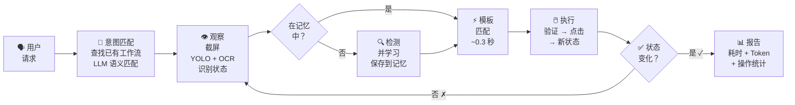

<div align="center">
  

  <h1>🦞 GUIClaw</h1>

  <p>
    <strong>看见屏幕。学会按钮。精准点击。</strong>
    <br />
    基于视觉的 macOS 桌面自动化技能，为 <a href="https://github.com/openclaw/openclaw">OpenClaw</a> 智能体打造。
  </p>

  <p>
    <a href="#-快速开始"></a>
    <a href="https://github.com/openclaw/openclaw"></a>
    <a href="https://discord.gg/BQbUmVuD"></a>
  </p>

  <p>
    
    
    
    
  </p>
</div>

---

<p align="center">
  <a href="../README.md">🇺🇸 English</a> ·
  <b>🇨🇳 中文</b>
</p>

---

## 🔥 更新日志

- **[03/19/2026]** v0.4.0 — **工作流记忆 + 异步轮询**：已保存的工作流通过 LLM 语义匹配自动复用；`wait_for` 命令（模板匹配轮询，禁止盲点）；强制计时与 token 增量报告；多窗口修复。
- **[03/19/2026]** v0.3.0 — **点击图状态架构**：UI 建模为状态图，每次点击创建新状态节点，通过 OCR 文字匹配识别状态。移除了 page/region/overlay 架构。
- **[03/17/2026]** v0.2.0 — 工作流重构，事件驱动轮询，强制操作协议（观察→验证→执行→确认），应用视觉记忆与自动清理。
- **[03/16/2026]** v0.1.0 — GPA-GUI-Detector 集成，Apple Vision OCR，模板匹配，浏览器自动化，站点记忆。
- **[03/10/2026]** v0.0.1 — 初始版本：微信/Discord/Telegram 自动化，应用档案，模糊匹配。

## 💬 使用效果

> **你**："用微信给小明发消息说明天见"

```
观察  → 截屏，识别当前状态
       ├── 当前应用：访达（不是微信）
       └── 需要切换到微信

状态  → 检查微信记忆
       ├── 之前学过？是（24 个组件）
       ├── OCR 可见文字：["聊天", "通讯录", "收藏", "搜索", ...]
       ├── 状态识别："initial"（89% 匹配）
       └── 当前状态可用组件：18 个

导航  → 查找联系人"小明"
       ├── 模板匹配搜索框 → 找到（conf=0.96）→ 点击
       ├── 粘贴"小明"（剪贴板 → Cmd+V）
       ├── OCR 搜索结果 → 找到 → 点击
       └── 新状态："click:小明"（聊天窗口打开）

验证  → 确认打开了正确的聊天
       ├── OCR 聊天标题 → "小明" ✅
       └── 如果不对 → 中止

执行  → 发送消息
       ├── 点击输入框（模板匹配）
       ├── 粘贴"明天见"（剪贴板 → Cmd+V）
       └── 按回车

确认  → 验证消息已发送
       ├── OCR 聊天区域 → "明天见" 可见 ✅
       └── 完成
```

<details>
<summary>📖 更多示例</summary>

### "帮我清理一下电脑"

```
意图  → 匹配已有工作流
       ├── CleanMyMac X / smart_scan_cleanup → 匹配成功
       └── 加载工作流步骤

观察  → 截屏 → CleanMyMac X 不在前台 → 激活
       ├── 获取主窗口边界（选最大窗口，跳过状态栏面板）
       └── OCR 识别当前状态

执行  → 按工作流步骤操作
       ├── 点击 "Scan" 按钮 → 扫描开始
       ├── wait_for "Run"（模板匹配轮询，每10秒检查）
       ├── 扫描完成 → 点击 "Run"
       ├── 退出应用对话框 → 点击 "Ignore"
       └── 等待清理完成

确认  → 截屏读取结果
       └── "清理了 2.99 GB 垃圾，无安全威胁" ✅

报告  → ⏱ 107s | 📊 +12k tokens | 🔧 5 screenshots, 4 clicks
```

### "查看 Claude 用量"

```
意图  → 匹配工作流：Claude / check_usage → 成功

观察  → Claude 未打开 → 启动

执行  → 点击用户头像 → Settings → Usage

确认  → OCR 读取用量：
       ├── 当前会话：34%
       ├── 本周：78%（Sonnet 12%）
       └── 额外用量：$50.68 / $50 (101%)

报告  → ⏱ 35s | 📊 +8k tokens | 🔧 3 screenshots, 3 clicks
```

### "看看我的 GPU 训练还在跑吗"

```
观察  → Chrome 已打开 → 识别目标：JupyterLab 标签页

导航  → 找到 JupyterLab 标签 → 点击切换

探索  → 多个终端标签可见
       ├── 截屏终端区域
       ├── LLM 视觉分析 → 识别 nvitop 所在标签
       └── 点击正确的标签

读取  → 截屏终端内容
       ├── LLM 读取 GPU 使用率表格
       └── 报告："8 块 GPU，7 块 100% — 实验正在运行" ✅
```

</details>

## 🚀 快速开始

**1. 克隆并安装**
```bash
git clone https://github.com/Fzkuji/GUIClaw.git
cd GUIClaw
bash scripts/setup.sh
```

**2. 授予辅助功能权限**

系统设置 → 隐私与安全性 → 辅助功能 → 添加 Terminal / OpenClaw

**3. 在 [OpenClaw](https://github.com/openclaw/openclaw) 中启用**（推荐）

在 `~/.openclaw/openclaw.json` 中添加：
```json
{ "skills": { "entries": { "gui-agent": { "enabled": true } } } }
```

然后直接和你的智能体对话 — 它会自动读取 `SKILL.md` 并处理一切。

## 🧠 工作原理



### 一次学习，永久匹配

**首次** — YOLO 检测全部元素（约 4 秒）：
```
🔍 YOLO: 43 个图标    📝 OCR: 34 个文字元素    🔗 → 保存 24 个固定 UI 组件
```

**之后每次** — 即时模板匹配（约 0.3 秒）：
```
✅ search_bar_icon (202,70) conf=1.0
✅ emoji_button (354,530) conf=1.0
✅ sidebar_contacts (85,214) conf=1.0
```

## 🔍 检测引擎

| 检测器 | 速度 | 检测内容 | 优势 |
|--------|------|----------|------|
| **[GPA-GUI-Detector](https://huggingface.co/Salesforce/GPA-GUI-Detector)** | 0.3s | 图标、按钮 | 能发现灰底灰色图标 |
| **Apple Vision OCR** | 1.6s | 文字（中英文） | 最佳中文 OCR，像素级精准 |
| **模板匹配** | 0.3s | 已知组件 | 学习后 100% 准确 |

## 📁 应用视觉记忆

每个应用拥有独立的视觉记忆，采用**点击图状态模型**。

```
memory/apps/
├── wechat/
│   ├── profile.json              # 组件 + 点击图状态
│   ├── components/               # 裁切的 UI 元素图片
│   │   ├── search_bar.png
│   │   ├── emoji_button.png
│   │   └── ...
│   ├── workflows/                # 保存的任务序列
│   │   └── send_message.json
│   └── pages/
│       └── main_annotated.jpg
├── cleanmymac_x/
│   ├── profile.json
│   ├── components/
│   ├── workflows/
│   │   └── smart_scan_cleanup.json
│   └── pages/
└── claude/
    ├── profile.json
    ├── components/
    ├── workflows/
    │   └── check_usage.json
    └── pages/
```

### 点击图（Click Graph）

UI 被建模为**状态图**。每个状态由屏幕上可见的组件集合定义。

**工作方式：**
1. **初始状态** = 应用首次打开时可见的内容（首次 `learn` 时捕获）
2. **点击创建状态** = 每次导致屏幕变化的点击都会创建新的 `click:组件名` 状态
3. **状态识别** = OCR 屏幕 → 将可见文字与每个状态的 `visible` 列表匹配 → 匹配率最高者胜出
4. **组件属于状态** = 一个组件可以出现在多个状态中
5. **匹配是状态相关的** = 只匹配属于当前识别状态的组件

**为什么这样设计：**
- 无需预定义"页面"或"区域" — 状态通过交互自动发现
- 状态识别速度快（OCR 文字匹配，无需视觉模型）
- 自然处理弹窗、覆盖层、嵌套导航
- 可扩展到具有复杂 UI 状态的应用

## 🔄 工作流记忆

完成的任务会被保存为可复用的工作流。下次收到类似请求时，智能体会自动语义匹配。

**匹配机制：**
1. 用户说"帮我清理一下电脑" / "扫描一下" / "run CleanMyMac"
2. 智能体列出目标应用的已有工作流
3. **LLM 语义匹配**（不是字符串匹配）— 智能体本身就是 LLM
4. 匹配成功 → 加载工作流步骤，观察当前状态，从正确步骤恢复
5. 没有匹配 → 正常操作，成功后保存新工作流

**`wait_for` — 异步 UI 轮询：**
```bash
python3 agent.py wait_for --app "CleanMyMac X" --component Run
# ⏳ Waiting for 'Run' (timeout=120s, poll=10s)...
# ✅ Found 'Run' at (855,802) conf=0.98 after 45.2s (5 polls)
```
- 每 10 秒模板匹配（单次约 0.3 秒）
- 超时 → 保存截图供检查，**绝不盲点**

## ⚠️ 安全与协议

每个操作遵循强制协议 — **写入代码中，而非仅文档约定**：

| 步骤 | 内容 | 原因 |
|------|------|------|
| **意图** | 将请求匹配到已有工作流 | 复用已验证的路径 |
| **观察** | 截屏 + YOLO + OCR + 记录 token 数 | 了解状态，追踪成本 |
| **验证** | 元素存在？正确窗口？精确文字匹配？ | 防止误点 |
| **执行** | 点击 / 输入 / 发送 | 执行操作 |
| **确认** | 再次截屏，检查状态变化 | 验证成功 |
| **报告** | `⏱ 45s \| 📊 +10k tokens \| 🔧 3 clicks` | 强制成本追踪 |

**代码中强制执行的安全规则：**
- ✅ 发送消息前验证聊天对象（OCR 聊天标题）
- ✅ 操作限制在目标窗口内（不点击窗口外区域）
- ✅ 精确文字匹配（防止 "Scan" 匹配到 "Deep Scan"）
- ✅ 多窗口应用自动选择最大窗口（跳过状态栏面板）
- ✅ 超时后不盲点 — 截图检查后决策
- ✅ 强制报告每次任务的耗时和 token 消耗

## 🗂️ 项目结构

```
GUIClaw/
├── SKILL.md                 # 🧠 智能体首先读取这个文件
├── scripts/
│   ├── setup.sh             # 🔧 一键安装
│   ├── agent.py             # 🎯 统一入口（观察→验证→执行→确认）
│   ├── ui_detector.py       # 🔍 检测引擎（YOLO + OCR）
│   ├── app_memory.py        # 🧠 视觉记忆（学习/检测/点击/验证）
│   ├── gui_agent.py         # 🖱️ 任务执行器
│   └── template_match.py    # 🎯 模板匹配
├── actions/_actions.yaml    # 📋 原子操作定义
├── scenes/                  # 📝 应用工作流
├── apps/                    # 📱 应用 UI 配置
├── docs/core.md             # 📚 经验教训
├── memory/                  # 🔒 视觉记忆（gitignored）
└── requirements.txt
```

## 📦 环境要求

- **macOS** + Apple Silicon（M1/M2/M3/M4）
- **辅助功能权限**：系统设置 → 隐私与安全性 → 辅助功能
- 其余依赖由 `bash scripts/setup.sh` 自动安装

## 🤝 生态系统

| | |
|---|---|
| 🦞 **[OpenClaw](https://github.com/openclaw/openclaw)** | AI 助手框架 — 将 GUIClaw 作为技能加载 |
| 🔍 **[GPA-GUI-Detector](https://huggingface.co/Salesforce/GPA-GUI-Detector)** | Salesforce YOLO 模型，用于 UI 检测 |
| 💬 **[Discord 社区](https://discord.gg/BQbUmVuD)** | 获取帮助，分享反馈 |

## 📄 许可证

MIT
